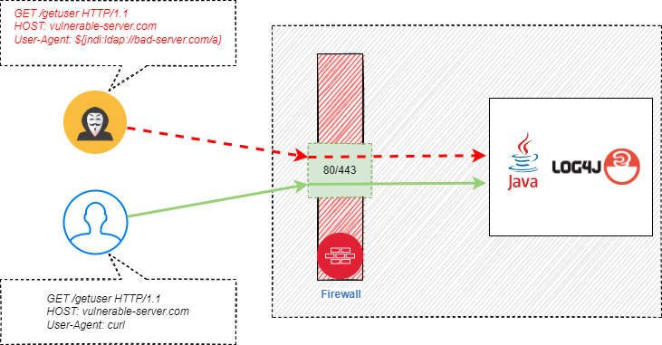
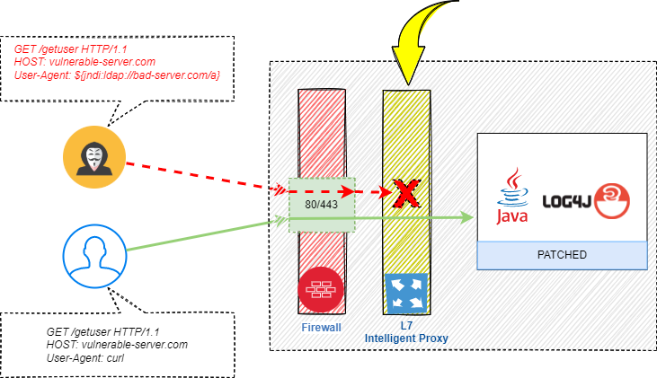
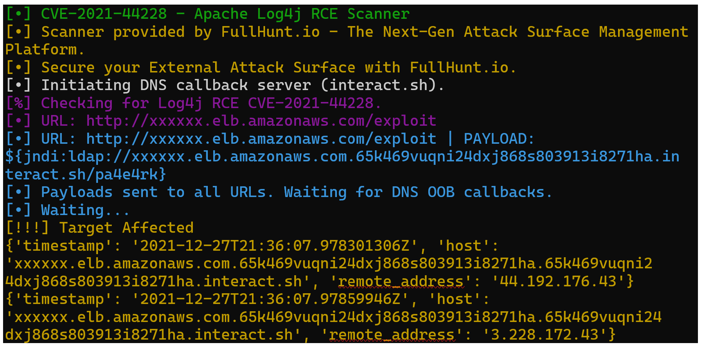
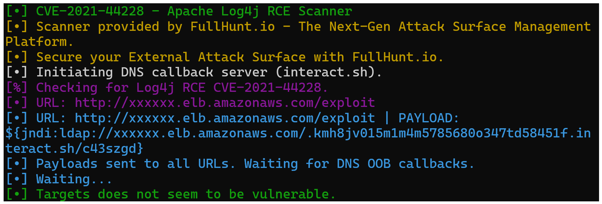

## Protect Kubernetes workloads from Log4j vulnerabilities

Log4j is among the most popular and highly used logging framework in Java based applications. On December 9, 2021, the world became aware of zero-day vulnerabilities [CVE-2021-44228](https://nvd.nist.gov/vuln/detail/CVE-2021-44228) and [CVE-2021-45105](https://nvd.nist.gov/vuln/detail/CVE-2021-45105) affecting the popular Apache package. Any attacker who can control log messages or log message parameters can execute arbitrary code loaded from malicious LDAP servers when message lookup substitution is enabled.

Organizations scrambled to fix issues with packages but more and more issues are being discovered. This package is being used in thousands of applications globally, and it is simply not possible to patch all applications in a short period of time.

You can protect many of these workloads with few approaches. Let us talk about approaches.

1. Patch Log4j package

   This is an ideal but as of December 2021, the package is not completely fixed (CVE-2021-45105). This might take some time until we see a good solution.
See [https://logging.apache.org/Log4j/2.x/security.html](https://logging.apache.org/Log4j/2.x/security.html) to track the progress.

2. Instruct Log4j package to disable lookups.

   For Log4j version >= 2.10, it was suggested that setting environment variable `LOG4J_FORMAT_MSG_NO_LOOKUPS` to true can prevent information leakage. Unfortunately, this does not prevent attacks completely. Please see official response by Apache Foundation.

3. Monitor and block offending messages in HTTP request pipeline

   This is a brute force solution and like cracking walnuts with a sledgehammer. But it is better to be safe than sorry. You can intercept HTTP traffic before it reaches a potentially vulnerable Java application, look for suspicious strings in headers and if found, block the request. This can be done by any intelligent layer 7 security system or even by running a proxy server. This solution will aid in blocking malicious requests reaching service Java applications, however at the cost of extra processing power.

Let us look at a simplified HTTP request pipeline. Typically, web servers listen at port 80 or 443 for TLS encrypted traffic. Any HTTP or HTTPS request is forward to the web server for processing. This is expected behavior until recently discovered Log4j vulnerabilities.



Using proposed solutions together, we can get decent protection from Log4j vulnerabilities until patched and well tested libraries are available and applied to solutions out there.

The solution will allow clean requests but block any call with exploit text in HTTP headers. This solution is generic and can be easily adopted for any web-based application. I will adopt it for protecting exploits for applications running in the Kubernetes cluster. The proposed solution is depicted below.



The demo application will use Istio for traffic filtering. Istio uses envoy proxy internally, and I will configure envoy HTTP filters to inspect, validate HTTP headers and offending requests will be blocked from reaching vulnerable web servers . I will also use Kubernetes Mutating Webhook as a second layer of defense to automatically inject `LOG4J_FORMAT_MSG_NO_LOOKUPS` environment variables into containers.

In this demo I will use Amazon Elastic Kubernetes Service (Amazon EKS) as platform of choice but example code can be easily applied on any Kubernetes cluster.

### Assumptions and prerequisites
To proceed, you must have the following:
* An existing AWS account with proper permissions.
* An existing and working EKS cluster with Kubernetes v1.21
* The latest versions of utilities installed and configured on the workspace that you will use to interact with AWS and the Amazon EKS cluster
  - aws cli
  - eksctl
  - git
  - istioctl
  - kubectl
  

### Install Istio
```bash
istioctl install --set profile=demo
kubectl label default ns istio-injection=enabled --overwrite
```

### Install sample application
```bash
git clone https://github.com/saleem-mirza/k8s-log4j-patch
cd k8s-log4j-patch

kubectl apply -f yelb-k8s-app.yaml

# Configure Istio routing
kubectl apply -f istio/gateway.yaml
kubectl apply -f istio/external-services.yaml
kubectl apply -f istio/yelb-services.yaml
```

### Test an application for vulnerability
Configure and validate vulnerability using any of methods described as below

1. https://github.com/fullhunt/log4j-scan
```python 
python3 log4j-scan.py -u http://xxxxxxxxxx.elb.amazonaws.com/exploit
```

2. https://www.lunasec.io/docs/blog/log4j-zero-day/#reproducing-locally
```bash 
curl -H 'X-Api-Version: ${jndi:ldap://127.0.0.1/a}' http://xxxxxxxxxx.elb.amazonaws.com/exploit
```
3. https://www.lunasec.io/docs/blog/log4j-zero-day/#how-to-identify-vulnerable-remote-servers
   
   Please follow the instructions in the above link.
   
You will notice that tools are detecting Log4j vulnerabilities.
Using option #1 of testing methods:
   


Next, I will apply following solutions to mitigate the Log4j vulnerabilities and run tests again to validate.

#### Deploy Mutating Webhook

This solution will inject `LOG4J_FORMAT_MSG_NO_LOOKUPS` as an environment variable into every container running under a particular namespace. But as I mentioned above, this does not protect our application completely and security experts have discovered  ways to bypass this flag. Moreover, this patch requires pods to be restarted to take effect which might not be an ideal solution.
Let us look at how to deploy this solution.
```bash
kubectl apply -f k8s-webhook/deployment.yaml
```
Now if you restart any pod in the default namespace or create a new pod, you will notice that it automatically injects an environment variable with name `LOG4J_FORMAT_MSG_NO_LOOKUPS` and its value equals to “true”.

#### Configure Istio envoy proxy for traffic filtering
The better solution is to stop traffic with Lo4j exploits from reaching vulnerable applications.  I will create an EnvoyFilter instructing Istio to monitor all HTTP headers of incoming traffic and block it from reaching the server if it detects any specially crafted text.
```bash
kubectl apply -f istio/envoy-filter/log4j-exploit-filter.yaml
```
This filter will only  monitor traffic which is targeted for vulnerable workload `/exploit`. This will avoid extra processing for applications which are not vulnerable such as non-java applications.

Since, we have applied patches to protect our applications. Let us re-test to validate our solutions as suggested above. You will notice that none of the methods are detecting any exploit.



### Cleanup
To undo changes made in Kubernetes cluster, execute the following CLI commands in the terminal

```bash
# remove label from default namespace
kubectl label default ns istio-injection-

# remove Istio configuration
kubectl delete -f istio/gateway.yaml
kubectl delete -f istio/external-services.yaml
kubectl delete -f istio/yelb-services.yaml
kubectl delete -f istio/envoy-filter/log4j-exploit-filter.yaml

# uninstall istio (if installed as part of this blog)
istioctl x uninstall -purge
kubectl delete ns istio-system

# uninstall mutation webhook
kubectl delete -f k8s-webhook/deployment.yaml

# uninstall yelb application
kubectl delete -f yelb-k8s-app.yaml
```

### Conclusion

We are finding many vulnerabilities in applications every day. Some are of high severity and some are of low impact. People and organizations are finding creative ways to exploit such vulnerabilities and use them for financial gain.

There is no single method to protect sensitive applications from such attacks. We need to be more vigilant and apply several layers of security around sensitive workloads and make it harder for people with malicious intent to break in.

The ideal solution for Log4j exploit is to find a good patch and apply to workloads at its earliest. However, this is not possible. In the proposed solution above, I blocked malicious requests from reaching legitimate application servers. This is a temporary solution which not only protects applications but also provides enough breathing room to businesses for fixing vulnerable applications.

I highly recommend following best practices of dependency management and software patching as part of long term strategy. You are most welcome to clone GitHub repository and highly appreciated for your contribution.
